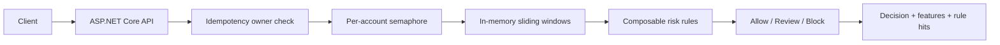
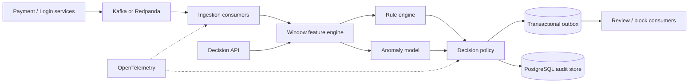

# FluxRisk architecture

## Product boundary

FluxRisk is a low-latency, explainable risk decision platform. It accepts transaction or login events and returns `allow`, `review`, or `block` together with the feature snapshot and triggered rules. It does not move money, train on private data, or pretend that deterministic rules are a learned fraud model.

## M0 runtime

The per-account semaphore preserves ordering for one account without globally serializing unrelated accounts. Event IDs are globally bound to one account, so a reused ID cannot mutate a second account's history.

## Target architecture

## Evolution rules

- In-memory state is a testable baseline; production state must be partitioned and durable.
- Idempotency means duplicate delivery returns the original decision without double-counting windows.
- Event time and processing time must remain distinct when out-of-order events are introduced.
- A machine-learning scorer is an adapter. Rules, thresholds, audit, replay, and fallbacks remain under application control.
- Every optimization must report throughput, p50/p95/p99, error rate, and decision correctness.
