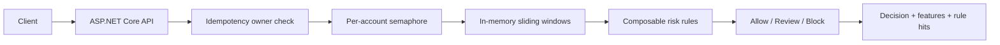
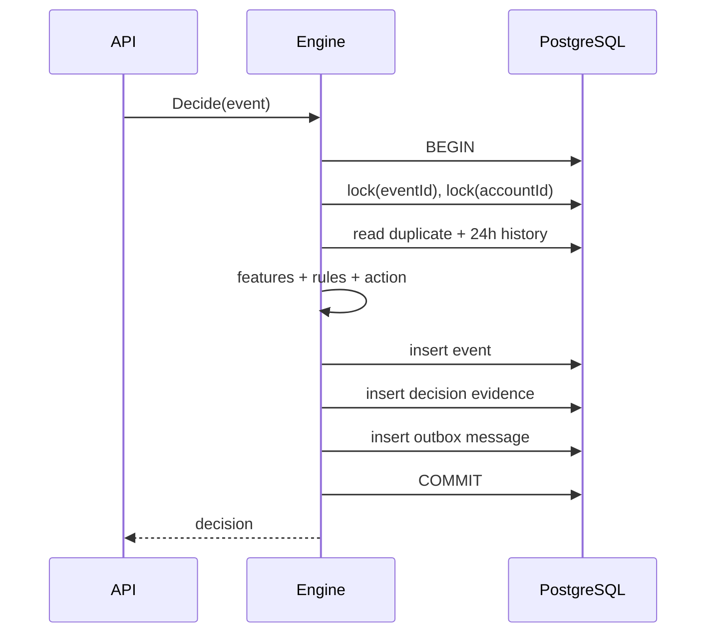
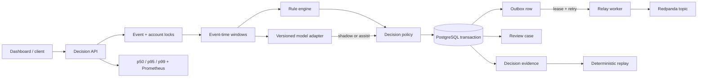

# FluxRisk architecture

## Product boundary

FluxRisk is a low-latency, explainable risk decision platform. It accepts transaction or login events and returns `allow`, `review`, or `block` together with the feature snapshot and triggered rules. It does not move money, train on private data, or pretend that deterministic rules are a learned fraud model.

## M0 runtime

The per-account semaphore preserves ordering for one account without globally serializing unrelated accounts. Event IDs are globally bound to one account, so a reused ID cannot mutate a second account's history.

## M1 durable runtime

The two advisory locks protect different invariants. The event lock prevents the same idempotency key from being claimed concurrently by different accounts. The account lock serializes window updates for one account across multiple API processes without blocking unrelated accounts. Event, decision, and outbox records share one transaction; no consumer can observe a message for a decision that was rolled back.

The application selects storage through `ConnectionStrings__FluxRisk`. When it is absent, the same engine runs against the in-memory adapter. When present, startup applies embedded, versioned migrations before accepting traffic.

See [M1 durable-state notes](m1-durable-state.md) for schema, failure cases, and verification commands.

## M2–M6 implemented architecture

## Evolution rules

- In-memory state is a testable baseline; production state must be partitioned and durable.
- Idempotency means duplicate delivery returns the original decision without double-counting windows.
- Event time and processing time must remain distinct when out-of-order events are introduced.
- A machine-learning scorer is an adapter. Rules, thresholds, audit, replay, and fallbacks remain under application control.
- Every optimization must report throughput, p50/p95/p99, error rate, and decision correctness.

## Failure boundaries

| Boundary | Mechanism | Why it exists |
|---|---|---|
| Duplicate request | globally locked event ID | prevents double-counting and cross-account key reuse |
| Concurrent account events | account advisory lock | preserves window ordering without a global lock |
| Database commit vs broker publish | transactional outbox | avoids the dual-write gap |
| Relay crash | renewable lease | another worker can reclaim abandoned rows |
| Broker outage | exponential retry then dead-letter | prevents hot loops and keeps poison records inspectable |
| Out-of-order event | watermark | accepts bounded lateness, rejects silently corrupting history |
| Model regression | default shadow mode | records evidence without changing customer outcomes |
| Concurrent case review | expected version | prevents lost updates |
